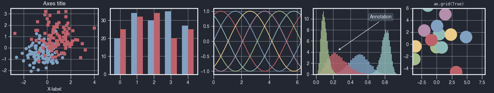

# Nord Deep Matplotlib Stylesheets

### Based on Marlos's [VSCode Nord Deep Theme](https://github.com/marlosirapuan/vscode-theme-nord-deep) with influence from Dominik Haitz's [matplotlib stylesheets](https://github.com/dhaitz/matplotlib-stylesheets)

`nord-deep.mplstyle` is inspired by Nord Deep v0.1.6.23 before the darker background update.
<br>
`nord-deep-new.mplstyle` is inspired by the latest version of Nord Deep with a darker background.

## Installation

You can either download the raw files and store them in your local directory under `.../matplotlib/mpl-data/stylelib/` and run

```py
plt.style.use("nord-deep")
```

or alternatively, you can call

```py
plt.style.use('https://github.com/kimichenn/nord-deep-mpl-stylesheet/raw/main/nord-deep.mplstyle')
```

## Contributing

Feel free to modify the color orders or anything else you see fit and submit a PR.

## Screenshots

### Nord Deep v1.0.623



### Nord Deep New (v1.0.624)


